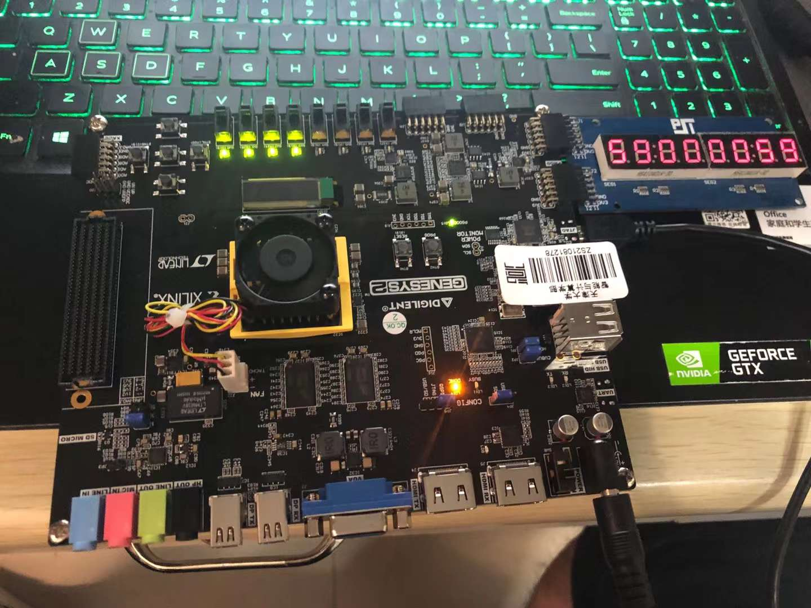

# SimpleMIPS

A Simple 5-stage pipeline MIPS CPU for TJU Computer Architecture Course.

## 工程目录
- report: 实验报告
- src: 源代码
- AXI: AXI 总线接口
- Cache: Cache的实现
- TEMU：使用 C 语言开发的 MIPS32 仿真器，可用于做差分测试，使用 git submoudle 进行管理
- testbench：基准测试程序
- soc_sram_func: 测试 SRAM 测试用例的工程文件夹
- soc_axi_func: 测试 AXI 测试用例的工程文件夹

在我们测试 axi 的时候，由于 LED 灯不亮，所以使用的七段数码管代替的 LED 灯的功能，具体实现是在 `soc_io.h` 里面往七段数码管的地址写一些值。最终也可以证明测试通过。

在测试 SRAM 和 AXI 的时候，我们分别有不同的测试用例， SRAM 是小端的，请见 `testbench/SRAM`;  AXI 是大端的，请见 `testbench/AXI` 。
