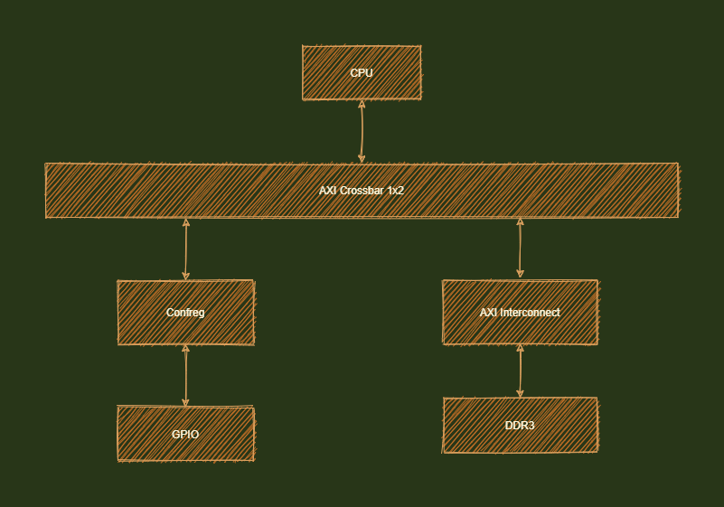
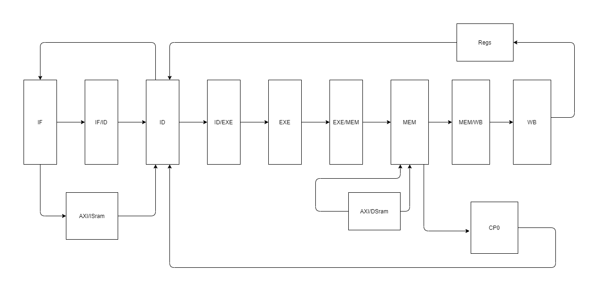
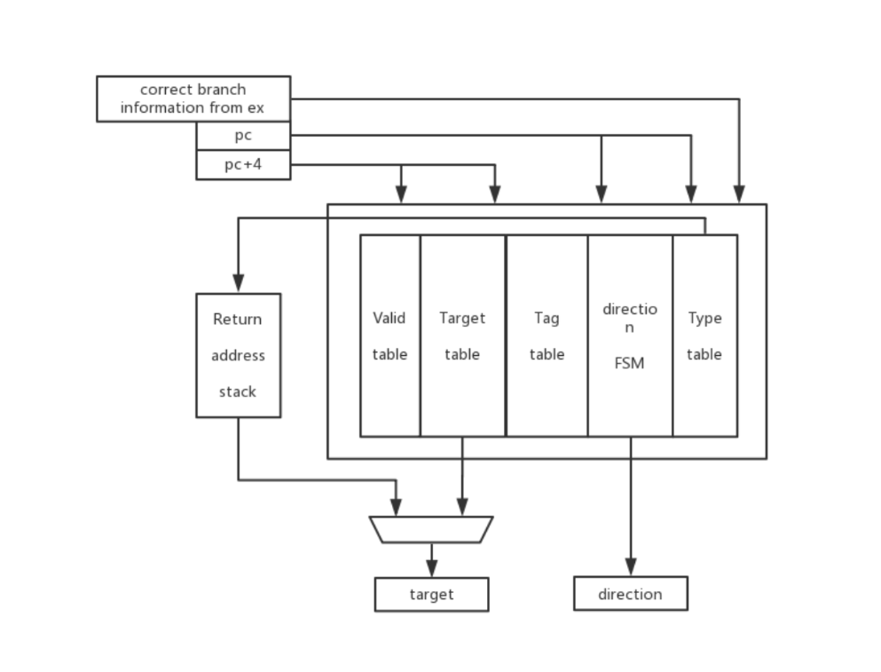

# 体系结构答辩报告

## SimpleMIPS 简介

SimpleMIPS 是一个开源的基于 MIPS 指令集的 CPU，他有以下特性：

- 基于 C 语言开发的 MIPS 指令模拟器，可用来做差分测试

- 朴素的 **五级流水线** CPU
- 支持 **57** 条MIPS 指令
- 支持 **SRAM** 和 **AXI** 的访存形式
- 支持 **延迟槽** 和基于 **BHT** 的分支预测器(由于时间原因完全调试成功，因此我们在项目中选用延迟槽的策略)
- 适配 **GENESYS2 FPGA**

## SoC 结构



## SimpleMIPS CPU 的主体架构



## CPU 实现

### 五级流水线

- 取指阶段：根据译码阶段传输过来的信息判断下一条指令的地址，并将指令地址送入存储器 (Sram 或者 AXI) 中取指，并将指令送入译码阶段
- 译码阶段：根据取指阶段和指令存储器送入的信息将指令解析成对应的指令信号，并从寄存器堆中取数据，将信号送入执行阶段
- 执行阶段：执行除存储相关的指令，并将信号送入访存阶段
- 访存阶段：在这一阶段将处理读写内存相关的指令，具体为根据不同的指令调整读取和写入的数据信号量，并将其送入数据存储器 (AXI/DSram) 中，在这一段也会进行异常处理，将信息送入 `CP0` 中。
- 写回阶段：在这一阶段将执行写回寄存器的操作。

### 分支预测器

分支预测是在流水线取指阶段提前猜测分支指令。我们使用基于 BHT 的方法来实现动态分支预测。在实现中我们实现了几个存放历史信息的查找表(存放分支指令的类型、跳转信息以及跳转情况)。因为程序中分支指令不多，我们决定采用直接映射的 Cache 存放分支信息，这样可以将 PC 直接作为索引，简化逻辑也确保存入查找表的是分支指令（因为用到 Cache 后期会继续调试和完善，先完成了查找表等基础部分代码）。对于循环类型的分支结构（通常出现在 BEQ、BNE 等指令），采用缓存直接存储近期出现的分支跳转指令和分支指令类型，这些信息由执行阶段提供。对于调用类型的分支预测，预测期中实现了一个返回地址栈。此时， JAL 指令继续采用缓存预测跳转地址，因为缓存中存放了跳转类型，那么在对 JAL 指令进行预测后可以将其对应的 PC + 8 后压入栈，再遇到 JR 指令时直接从栈中获取跳转地址。



### 异常处理

MIPS 中的异常是“精确异常”。对于实现 “精确异常” 的处理器，若有一条发生异常的朱玲，则在这条指令之前的指令都要正常执行，而这条指令之后的指令都将被取消。为了实现 “精确异常”，在流水线上执行的指令若发生了异常，并不会立即处理它，而是把它记录下来，送到一个指定的阶段统一处理。在我们的处理器中，每条指令发生的异常都会在 MEM 阶段统一处理。

访存阶段检测到异常后，将按照优先级顺序向 CP0 寄存器报告异常类型，并向流水线控制部件告知发生了异常。MEM 及前面流水段的指令将全部清除，异常基地址将被送入 PC 寄存器， Cause 寄存器记录异常编号以及是不是延迟槽指令发生异常，Status 寄存器的 EXL 位置1，表示进入异常处理阶段。这时，中断被屏蔽，即不会处理外部中断。对于地址错类型的一场，除了执行上述操作，还会将错误的地址写入 BadVAddr 寄存器。中断处理例程完成后，一般会执行异常返回指令。在我们的处理器中，异常返回被视为一种特殊的异常，处理机制类似于其他异常，只不过处理过程中送入 PC 寄存器的是 EPC 寄存器 的值，Status 寄存器的 EXL 位置0，表示异常处理完成，Status 寄存器的其他位以及其他 CP0 寄存器不会做任何修改。

#### 我们处理器支持的异常处理如下表：

| 异常类型 | 助记符 | ExcCode 编码 | 异常描述                   |
| -------- | ------ | ------------ | -------------------------- |
| 中断     | Int    | 0x00         | 检测到了中断               |
| 读地址错 | AdEL   | 0x04         | 指令地址或读数据地址不对齐 |
| 写地址错 | AdES   | 0x05         | 写数据地址不对齐           |
| 系统调用 | Sys    | 0x08         | 执行了系统调用指令         |
| 断点     | Bp     | 0x09         | 执行了断点指令             |
| 保留指令 | RI     | 0x0a         | 执行了未实现的指令         |
| 算术溢出 | Ov     | 0x0c         | 定点数加减法溢出           |

#### 我们处理器实现的 CP0 寄存器如下表：

| 选择 | 编号 | 名称     | 功能简述           | 读写性   |
| ---- | ---- | -------- | ------------------ | -------- |
| 0    | 8    | BadVAddr | 最近发生异常的地址 | 只读     |
| 0    | 9    | Count    | 计数器             | 读/写    |
| 0    | 11   | Compare  | 计数器中断控制器   | 读/写    |
| 0    | 12   | Status   | 状态寄存器         | 部分可写 |
| 0    | 13   | Cause    | 最近一次异常原因   | 部分可写 |
| 0    | 14   | EPC      | 最近发生异常的 PC  | 读/写    |

### AXI 协议适配

为了提高 CPU 的可扩展性并为之后实现 ICache/DCache 做准备，我们实现了 CPU 对于 AXI 接口的适配，由于没有 Cache，因此我们不需要实现 read/write burst，所以我们使用了龙芯提供的 `cpi_axi_interface` ，我们只要实现了对应的类 SRAM 接口即可。分别采用了 **状态机** 和 **非状态机** 两种策略来尝试实现：

#### 状态机

在状态机的实现中，以读取来举例，我们分别使用 `rcurrent_state` 和 `rnext_state` 来记录当前的状态和下一个状态，首先，由组合逻辑来修改 `rnext_state`,主要通过查看 `ice`，`addr_ok`, `data_ok` 几个状态来修改状态机的下个状态，而在时序逻辑中，当每次时钟的上升沿到来时，我们都判断当前状态，并将当前状态修改为下个状态，并修改输出信号。在读取的时候，我们也需要判断是否现在正在写，倘若正在写的话，也不可以读，否则会产生读写冲突。在每次读取的时候，都要产生暂停，在读取完成后取消暂停。

#### 非状态机

在非状态机的版本中我们没有使用状态机，当每次到时钟上升沿的时候输出信号，我们规定了 `addr_rcv` 和 `do_finish` 分别表示地址握手成功和数据握手成功：

```verilog
    always @(posedge clk) begin
        addr_rcv <= rst          ? 1'b0 :
                    ~data_data_ok & data_req & data_addr_ok ? 1'b1 :    //data_data_ok优先
                    data_data_ok ? 1'b0 : addr_rcv;
    end

    always @(posedge clk) begin
        do_finish <= rst          ? 1'b0 :
                     data_data_ok ? 1'b1 :
                     ~longest_stall ? 1'b0 : do_finish;
    end
```

其中，我们规定了 `i_stall` 和 `d_stall` 作为输出信号作为指令暂停和数据暂停的标志，而 `longest_stall` 的定义则是由于有多种原因导致 cpu 暂停(取指、访存、乘除法)，如果在乘除法暂停期间，取指已经完成，但 cpu 还在暂停，此时就可能导致重复第二次取指，因此我们还需要一个信号，能够表示 cpu 流水线暂停的整个使其。根据该信号，我们能够保证一次流水线暂停只取一次指令，只进行一次内存访问。

## 实验结果展示：

笔者曾经发了张朋友圈来表达终于调试成功的心情：


## 未来的展望

- 将 **分支预测器** 适配成功
- 实现 **ICache/DCache** 以提升性能
- 切分成更多的流水线以提升性能
- 实现 **动态取指/不对等算术逻辑运算/华莱士树乘法器**
- 实现更多的指令
- 运行一个小型的操作系统

